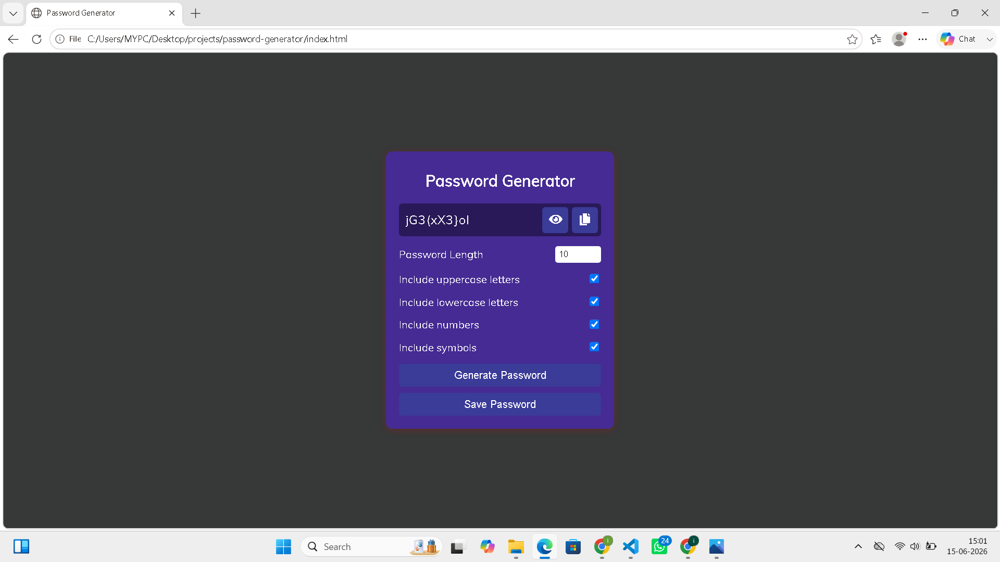

# 🔐 Password Generator

A simple and responsive Password Generator built using HTML, CSS, and JavaScript.

## Features

- Generate secure passwords
- Custom password length (5–15 characters)
- Include:
  - Uppercase letters
  - Lowercase letters
  - Numbers
  - Symbols
- Copy password to clipboard
- Save generated password as a text file

## Technologies Used

- HTML5
- CSS3
- JavaScript

 ## Screenshot

## Project Demo

Generate strong passwords instantly with customizable options.

## Author

R.Indhu Varshini
